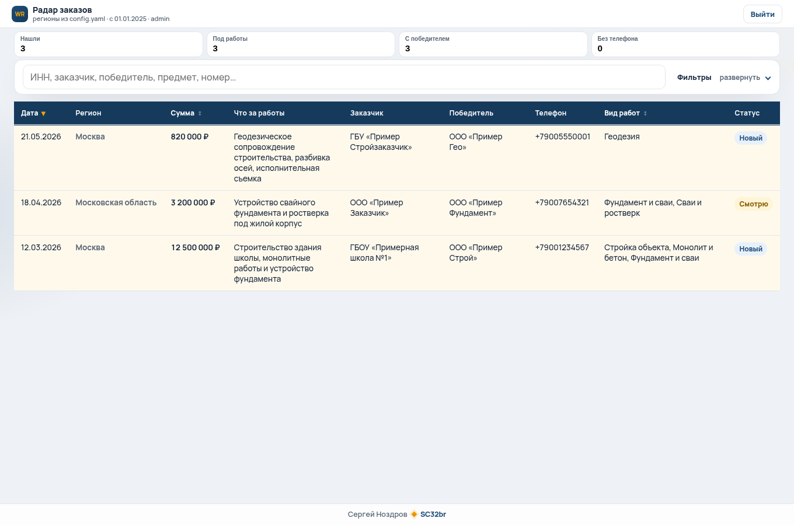
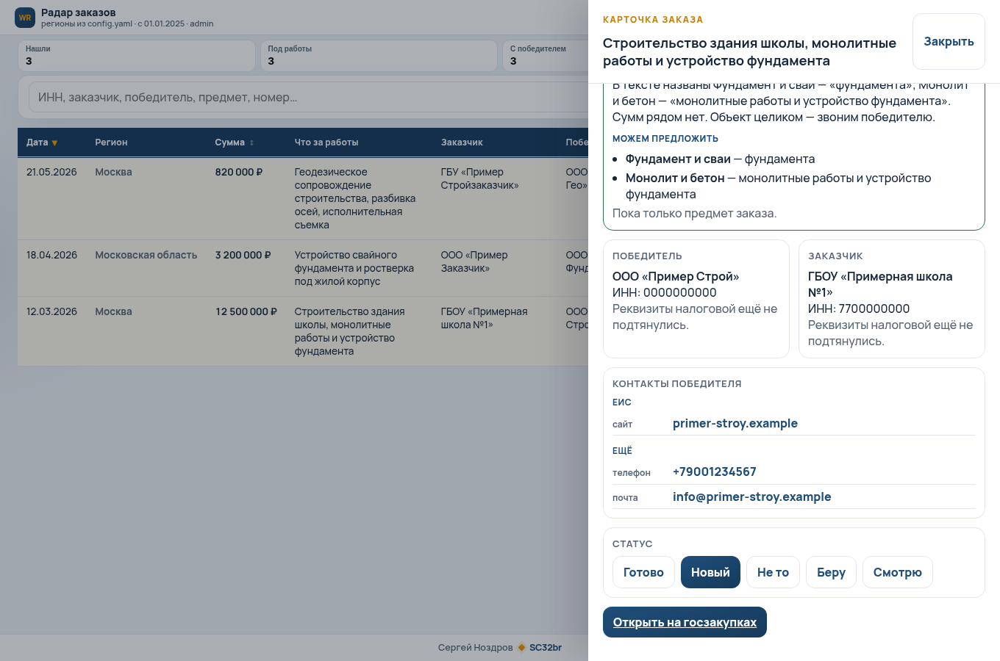

# Радар заказов

Стол подписанных контрактов. Субподрядчик открывает карточку, видит кто выиграл стройку, телефон, почту, сколько в смете, и звонит этой фирме.

Код жил в ночном сборе на реальном контуре. Клиентские имена, ключи и база сюда не входят. Здесь скелет: FastAPI, SQLite, Jinja, те же коллекторы.

С января 2025 FTP ЕИС закрыт. Официальный SOAP почти никому не светит: нужен сертификат или токен ЕСИА. На GitHub лежат мёртвые FTP-сборщики и платные обёртки над DaMIA. Этот репозиторий показывает рабочий контур HTML + JSON: лента, карточка контракта, обогащение, дашборд.

GitHub Pages этот сервис не поднимет. Это FastAPI, ему нужен процесс Python.

Лента после входа и карточка лота. На кадрах демо-фирмы, не живой клиент.





## Зачем стол

Победителя берут с карточки контракта, из таблицы поставщика. Вкладку участников для этого можно не открывать. Если ИНН на ленте пустой, его достают из реестрового номера. На карточке уже есть сумма, заказчик, ссылка на ЕИС, контакты с нескольких полок (сайт фирмы, файлы закупки, Checko, DaData). Человек ставит статус: новый, смотрю, беру, не то, готово. Звонок с экрана. Ленту в Telegram этот скелет не шлёт.

## Что собирает

- ЕИС (zakupki.gov.ru): HTML реестра контрактов 44-ФЗ. Регион задаётся КЛАДР области, голый код субъекта в `customerPlace` молча игнорируется. У запроса нужен обычный браузерный User-Agent. Файлы с вкладки документов плюс журнал событий. Ссылки берутся с страницы как полные href.
- mos.ru: JSON. Закрывает Москву, регионы РФ не покрывает.
- ClearSpending: профиль победителя, сколько ещё контрактов в открытых данных.
- Checko и DaData: реквизиты и контакты по ИНН. Ключи только из `.env`.
- Сайт победителя по ИНН, если нашёлся.

Словарь стройки лежит в `config.yaml`: школа, монолит, сваи, геодезия, земля и сети. Порог суммы по умолчанию 500 000 ₽. Свои ИНН в ленту не кладутся (`own_inns`, в скелете пусто).

## Запуск локально

Python 3.11+.

```bash
python3 -m venv .venv
. .venv/bin/activate
pip install -r requirements.txt
cp .env.example .env
```

В `.env` задайте `DASHBOARD_PASSWORD` и `SESSION_SECRET` (`openssl rand -hex 32`). Логин по умолчанию `admin`, хост `localhost`.

```bash
uvicorn app.main:app --host 127.0.0.1 --port 8000
```

Откройте http://127.0.0.1:8000. Первый старт кладёт в SQLite три вымышленных лота: ООО «Пример Строй» и ещё две фирмы. Живой сбор:

```bash
python -m app.collect
```

Утренний режим за последние дни: `python -m app.collect --daily`.

Пример unit-файлов: `deploy/radar.service` и `deploy/radar-daily.timer`. Пути внутри замените на свои.

## Переменные окружения

Имена в `.env.example`. Секреты в git не класть.

- `SITE_HOST`, `SITE_PUBLIC_URL`, `APP_BIND`, `APP_PORT`
- `DASHBOARD_LOGIN`, `DASHBOARD_PASSWORD`
- `SESSION_SECRET`, `SESSION_COOKIE_NAME` (по умолчанию `radar_session`), `SESSION_HOURS`, `SESSION_HTTPS_ONLY`
- `TRUSTED_HOSTS`, `DATA_DIR`
- `DADATA_API_KEY`, `DADATA_SECRET_KEY`
- `CHECKO_API_KEY`
- `LLM_API_KEY` и соседние `LLM_*` (разбор смет, можно не задавать)
- `EIS_PROXY` (если с вашей сети zakupki.gov.ru не открывается)

## Лимиты

Checko на бесплатном тарифе около 100 запросов в день. DaData около 1000, телефоны на дешёвом тарифе не отдаёт. mos.ru не заменяет региональную ЕИС. HTML ЕИС иногда отвечает пустым телом, коллектор ретраит. На 403 и капчу есть пауза; в живом прогоне капчи не было, файл с ЕИС качался как файл.

## Чего здесь нет

Подачи заявок на торги нет. Telegram-бота в этом скелете нет, дамп ленты в мессенджер не делается. Официального SOAP ЕИС нет: без сертификата он вам всё равно не откроется.

## Для агентов

Краткий индекс: [llms.txt](llms.txt). Пакет Python: `app`. База: `data/radar.db` (в git не входит, кроме пустого `data/`). Демо-лоты создаёт `app/seed.py` при пустой таблице.

## Лицензия

MIT. Copyright (c) 2026 Сергей Ноздров.
